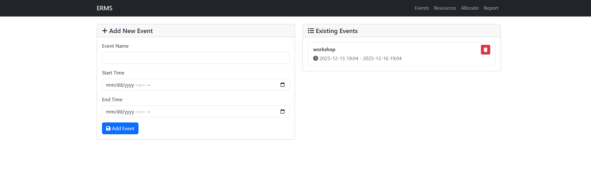
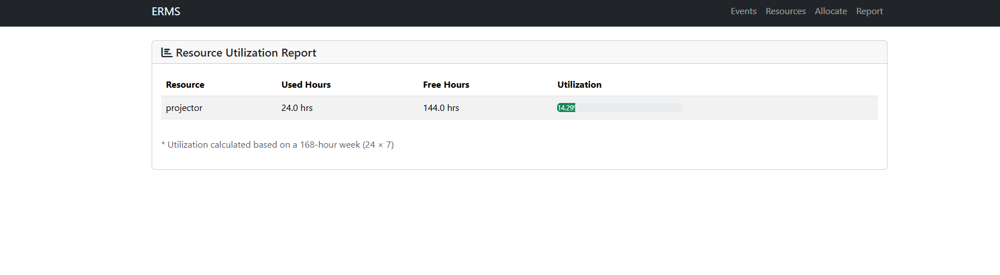

# Event Resource Management System (ERMS)

A Flask-based web application for managing events and allocating resources efficiently, with built-in conflict detection and utilization reporting.

---

## 🚀 Features

* Event creation, viewing, and deletion with start/end time support
* Resource management with type/category classification
* Resource allocation to events with conflict detection
* Weekly resource utilization report (used hours, free hours, utilization %)
* Responsive and clean UI using Bootstrap

---

## 🛠️ Tech Stack

* **Backend**: Flask, Flask-SQLAlchemy
* **Database**: SQLite
* **Frontend**: HTML, CSS, Bootstrap, Jinja2

---

## 📦 Installation & Setup

```bash
git clone <your-repository-url>
cd flask_project
pip install -r flask_app/requirements.txt
python flask_app/app.py
```

Open in browser:

```
http://localhost:5000
```

> SQLite database (`flask_app/instance/db.sqlite3`) is created automatically on first run.

---

## 📌 Application Pages

* Home – Dashboard
* Events – Manage events
* Resources – Manage resources
* Allocate – Assign resources to events
* Report – Weekly utilization report

---

## 🖼️ Screenshots







---

## 🎥 Demo Video

[https://drive.google.com/file/d/1UFDZ6IqbcSE7nL4qhh08ntxgUTm-fpGt/view?usp=sharing](https://drive.google.com/file/d/1UFDZ6IqbcSE7nL4qhh08ntxgUTm-fpGt/view?usp=sharing)

---

## 👤 Author

**IYDA ROSE BELL L**
Event Resource Management System (ERMS)
Built using Flask & Bootstrap

---

© 2025 Event Resource Management System

